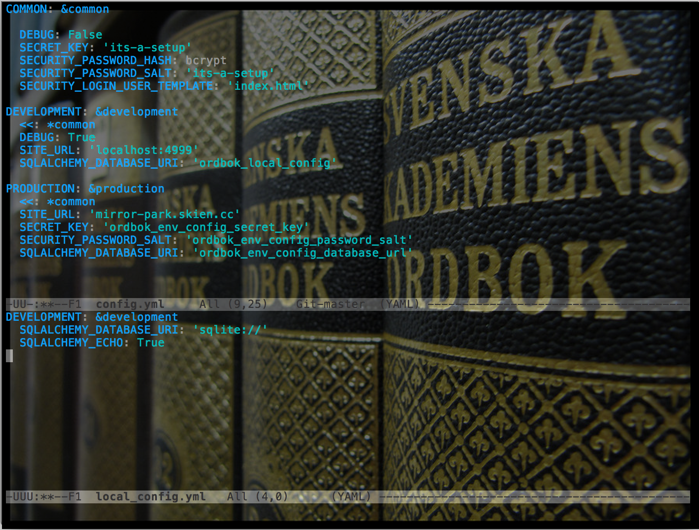

title: Flask Hacks and Best Practices
output: presentation.html
<!-- theme: jdan/cleaver-retro -->
author:
  name: Erik Taubeneck
  twitter: taubeneck
  url: http://skien.cc
  github: github.com/eriktaubeneck

--

# Flask Hacks and Best Practices

## Erik Taubeneck

--

### About Me

<div class="author">
<h1 class="name">Erik Taubeneck</h1>
<h3 class="twitter">
<a href="http://twitter.com/@taubeneck">@taubeneck</a>
</h3>
<h3 class="github">
<a href="https://github.com/github.com/eriktaubeneck">github.com/eriktaubeneck</a>
</h3>
<h3 class="url">
<a href="http://skien.cc">http://skien.cc</a>
</h3>
</div>

--

### About Me

<div class="author" style="text-align: center; margin-top:-150px; margin-bottom:-70px; font-size:20px">
<h1 class="name">Platform Engineer @ </h1>
</div>

<div style="text-align: center; margin-top:-50px;">


</div>

--

### Overview

- Flask Crash Course
- Flask app factory pattern
- Using Celery with the app factory pattern
- Context Processors
- Configurations
- Building Custom Extensions

--

### Flask Crash Course


<div style="text-align: center; margin-top:100px">
[](http://flask.pocoo.org/)
</div>

_Flask is a microframework for Python based on Werkzeug, Jinja 2 and good intentions. And before you ask: It's [BSD licensed](http://flask.pocoo.org/docs/license/)!_

--

### Flask Crash Course

<div style="font-size:20px; margin-bottom:-38px; margin-top:-20px; margin-left:5px"> _hello.py_ </div>
```python
from flask import Flask, render_template
app = Flask(__name__)

@app.route("/")
def hello():
    return render_template('hello.html', message="Hello World!")

if __name__ == "__main__":
    app.run()
```

<div style="font-size:20px; margin-bottom:-38px; margin-top:-20px; margin-left:5px"> _templates/hello.html_ </div>
```
<html>
  <body>
    {{ message }}
  </body>
</html>
```

<div style="font-size:20px; margin-bottom:-38px; margin-top:-20px; margin-left:5px"> _bash_ </div>
```
> cd hello-flask
> virtualenv venv
> source venv/bin/activate
> pip install flask
> python hello.py
 * Running on http://localhost:5000/
```


--

### Application Factories


Instead of creating your app as

```python
from flask import Flask

app = Flask(__name__)
```

wrap it in a function

```python
from flask import Flask

def factory():
    app = Flask(__name__)
    return app
```

--

### Application Factories

Instead of accessing attributes of the `app` object


```python
from app import app

app.config['RELEVANT_CONFIG_VARIABLE']
```

use the Flask `current_app` function

```python
from flask import current_app

current_app.config['RELEVANT_CONFIG_VARIABLE']
```

--

### Application Factories

What's the big deal?

1. Testing. Create different instances of your `app`

--

### Application Factories

What's the big deal?


1. Testing. Create different instances of your `app`
2. Multiple Instances running in one process

--

### Application Factories

What's the big deal?


1. Testing. Create different instances of your `app`
2. Multiple Instances running in one process
3. `from app import app` -> circular imports

--

### Application Factories

A more thorough example:

```python
from flask import Flask
from app.utils.processors import register_processors
from app.models import db
from app.views.index import index_bp
from app.views.admin import admin


def create_app(config=None, environment=None):
    app = Flask(__name__)
    app.config['ENVIRONMENT'] = environment
    app.config.update(config or {})

    db.init_app(app)
    admin.init_app(app)

    app.register_blueprint(index_bp)
    register_processors(app)

    return app
```

--

### Application Factories

Most Flask extensions provide a `init_app` method.

For example:

```python
class FlaskExtension(object):
    def __init__(self, app=None):
        if app:
            self.init_app(app)

    def init_app(self, app):
        if not hasattr(app, 'extensions'):
            app.extensions = {}
        app.extensions['EXTENSION'] = self
```

<div style="font-size: 25px;">
<ul>
<li> Note that we do not set `self.app = app` on the extension. </li>
<li> Extensions should be designed to work with multiple app. </li>
<li> Should always use `current_app` if the `app` object is needed. </li>
</ul>
</div>

--

### Using Celery with App Factories

TODO

--

### The Magic of Context Processors

In our base template, we likely have something like this near the top of the page.

```

  <div class="signup">
    Welcome {{ user.full_name }}!
    <a href="{{ url_for('profile', user) }}">(Profile)</a>
  </div>

 <div class="signup">
    Welcome!
    <a href="{{ url_for('signup') }}">Signup to join.</a>
  </div>

```

--

### The Magic of Context Processors

To handle this

```python
from flask.ext.security import current_user

@bp.route('/gnarly')
def gnarly():
    ...
    return render_template('gnarly.html', user=current_user)

@bp.route('/tubular')
def tubular():
    ...
    return render_template('tubular.html', user=current_user)

@bp.route('/way-cool')
def way_cool():
    ...
    return render_template('way_cool.html', user=current_user)

@bp.route('/awesome')
def awesome():
    ...
    return render_template('awesome.html', user=current_user)

```


--

### The Magic of Context Processors

We can use a Flask Context Processor to always inject the `current_user` object

```python
from flask.ext.security import current_user

def user_context_processor():
    if current_user.is_authenticated():
        user = current_user._get_current_object()
    else:
        user = None
    return {
        'user': user,
    }

def register_processors(app):
    app.context_processor(user_context_processor)
```

--

### The Magic of Context Processors

We simplify our routes

```python
@bp.route('/gnarly')
def gnarly():
    ...
    return render_template('gnarly.html')

@bp.route('/tubular')
def tubular():
    ...
    return render_template('tubular.html')

@bp.route('/way-cool')
def way_cool():
    ...
    return render_template('way_cool.html')

@bp.route('/awesome')
def awesome():
    ...
    return render_template('awesome.html')
```

--

### The Magic of Context Processors

and simplify usage in the template

```

  <div class="signup">
    Welcome {{ user.full_name }}!
    <a href="{{ url_for('profile', user) }}">(Profile)</a>
  </div>

  <div class="signup">
    Welcome!
    <a href="{{ url_for('signup') }}">Signup to join.</a>
  </div>

```

--

### Flask Configurations

<div style="margin-bottom:-15px">
By default, `app.config` is a `dict` like object with
</div>

```
<Config {
    'JSON_AS_ASCII': True,
    'USE_X_SENDFILE': False,
    'SESSION_COOKIE_PATH': None,
    'SESSION_COOKIE_DOMAIN': None,
    'SESSION_COOKIE_NAME': 'session',
    'LOGGER_NAME': '__main__',
    'DEBUG': False,
    'SECRET_KEY': None,
    'MAX_CONTENT_LENGTH': None,
    'APPLICATION_ROOT': None,
    'SERVER_NAME': None,
    'PREFERRED_URL_SCHEME': 'http',
    'JSONIFY_PRETTYPRINT_REGULAR': True,
    'TESTING': False,
    'PERMANENT_SESSION_LIFETIME': datetime.timedelta(31),
    'PROPAGATE_EXCEPTIONS': None,
    'TRAP_BAD_REQUEST_ERRORS': False,
    'JSON_SORT_KEYS': True,
    'SESSION_COOKIE_HTTPONLY': True,
    'SEND_FILE_MAX_AGE_DEFAULT': 43200,
    'PRESERVE_CONTEXT_ON_EXCEPTION': None,
    'SESSION_COOKIE_SECURE': False,
    'TRAP_HTTP_EXCEPTIONS': False
}>
```

--

### Flask Configurations

`app.config` can also configure extensions!

```python
class FlaskExtension(object):
    def __init__(self, app=None):
        if app:
            self.init_app(app)

    def init_app(self, app):
        if not hasattr(app, 'extensions'):
            app.extensions = {}
        app.extensions['EXTENSION'] = self
        self.active = app.config.get('EXTENSION_ACTIVE')
        self.style = app.config.get('EXTENSION_STYLE')
```

--

### Flask Configurations

Application Factories can become messy with config logic

```python
def create_app(config=None, environment=None):
    app = Flask(__name__)
    app.config['ENVIRONMENT'] = environment
    app.config.update(config or {})

    if app['ENVIRONMENT'] in ('PRODUCTION', 'TESTING'):
        app.config['EXTENSION_ACTIVE'] = True
    else:
        app.config['EXTENSION_ACTIVE'] = False

    if app['ENVIRONMENT'] = 'TESTING':
        app.config['EXTENTION_STYLE'] = 'testing'

    if app['ENVIRONMENT'] = 'PRODUCTION':
        app.config['SECRET_KEY'] = '27d4c2bc-0fac-4ea1-98e8-1ea1feba31f1'
        app.config['SERVER_NAME'] = 'flask-special.com'
    ...
    return app
```

--

### Flask Configuration

Use the right tool for the job.

<div style="font-size:20px; margin-bottom:-38px; margin-top:-20px; margin-left:5px"> _config.yaml_ </div>
```python
COMMON: &common
  DEBUG: False
  EXTENSION_ACTIVE: True

DEVELOPMENT: &development
  <<: *common
  EXTENSION_ACTIVE: False

TESTING: &testing
  <<: *common
  EXTENSION_STYLE: 'testing'

PRODUCTION: &production
  <<: *common
  SECRET_KEY: '27d4c2bc-0fac-4ea1-98e8-1ea1feba31f1'
  SERVER_NAME: 'flask-special.com'
```

--

### Ordbok

A library for managing complex configurations.

- YAML based configurations (JSON also supported*)
- Allows for config variables to easily be overridden
  - Creates a hierarchy of configuration sources
  - `config.yml` < `local_config.yml` < _env_
  - Explicitly require variables in later configurations
- Encrypted config file type for secrets


<div style="font-size:20px;"> _* JSON is valid YAML_ </div>

--

### Ordbok

Example Configuration

<div style="font-size:20px; margin-bottom:-38px; margin-top:-20px; margin-left:5px"> _config.yaml_ </div>
```python
COMMON: &common
  DEBUG: False
  EXTENSION_ACTIVE: True

DEVELOPMENT: &development
  <<: *common
  EXTENSION_ACTIVE: False
  SQLALCHEMY_URL: 'ordbok_local_config'

PRODUCTION: &production
  <<: *common
  SECRET_KEY: 'ordbok_private_config'
  SQLALCHEMY_URL: 'ordbok_env_config_database_uri'
  SERVER_NAME: 'flask-special.com'
```

--

### Ordbok

Using with Flask

```python
from ordbok.flask_helper import FlaskOrdbok


def create_app(config=None, environment=None):
    app = Flask(__name__)
    ordbok = FlaskOrdbok(app)
    ordbok.load()
    app.config.update(ordbok)
    app.config.update(config or {})
    ...
    return app

if __name__ == '__main__':
    app = create_app(environment='DEVELOPMENT')
    ordbok = app.extensions['ordbok']
    ordbok.app_run(app)
```

`ordbok.app_run(app)` will auto-reload on changes to yaml config, as well as changes to python source files.

--

### Ordbok

<div style="top-margin:-20px; bottom-margin:-20px; text-align:center">
Help Hack on Ordbok!
</div>
<div style="top-margin:-20px; bottom-margin:-20px; text-align:center">
[https://github.com/eriktaubeneck/ordbok](https://github.com/eriktaubeneck/ordbok)
</div>

<div style="top-margin:-20px; bottom-margin:-20px; text-align:center">
[](https://travis-ci.org/eriktaubeneck/ordbok)
[](https://coveralls.io/r/eriktaubeneck/ordbok)
[](https://codeclimate.com/github/eriktaubeneck/ordbok)
[](https://readthedocs.org/projects/ordbok/?badge=latest)
[](https://pypi.python.org/pypi/ordbok/)
[](https://pypi.python.org/pypi/ordbok/)
[](https://pypi.python.org/pypi/ordbok/)


</div>

--

## Write a Flask Extension

TODO
